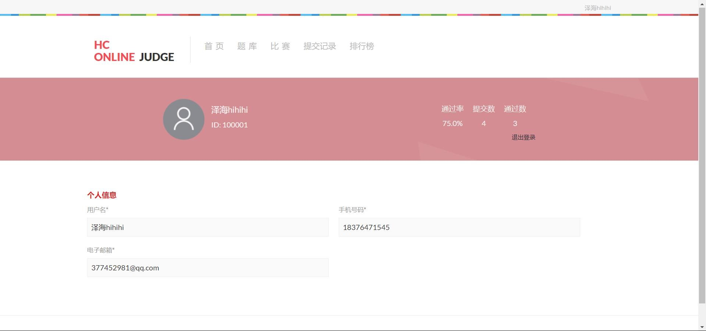
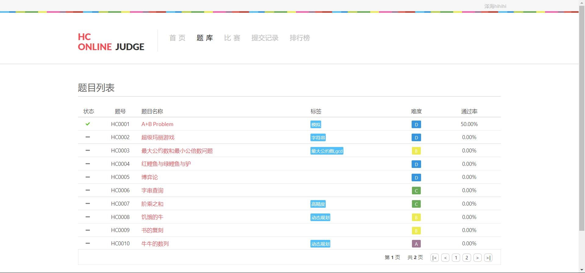
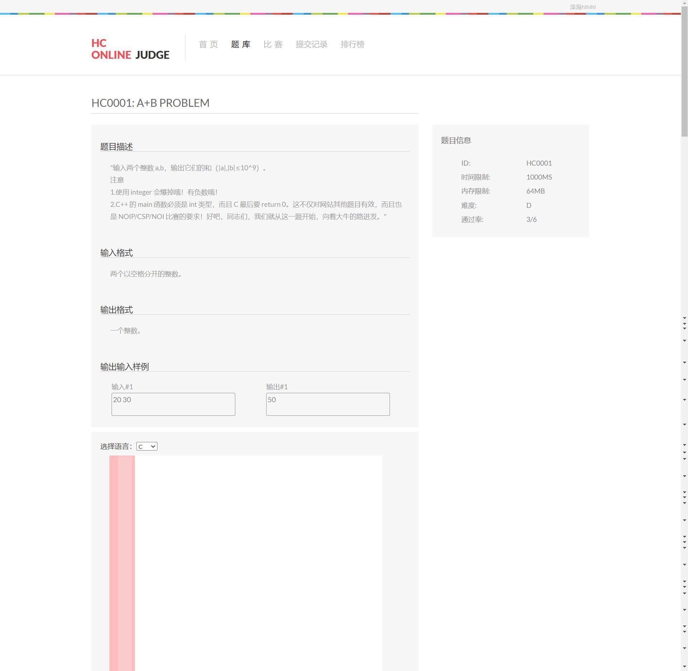
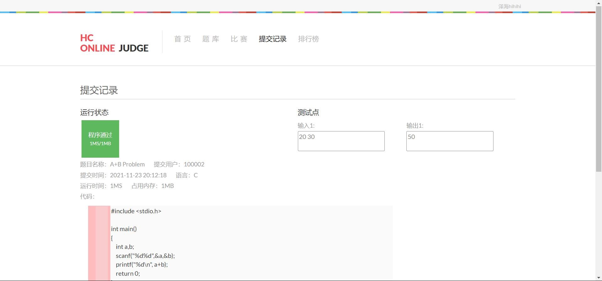
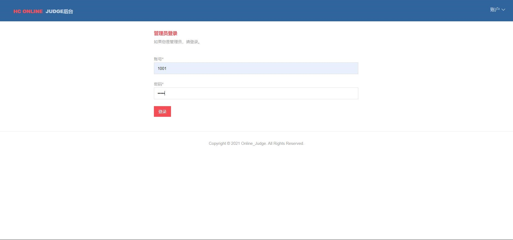
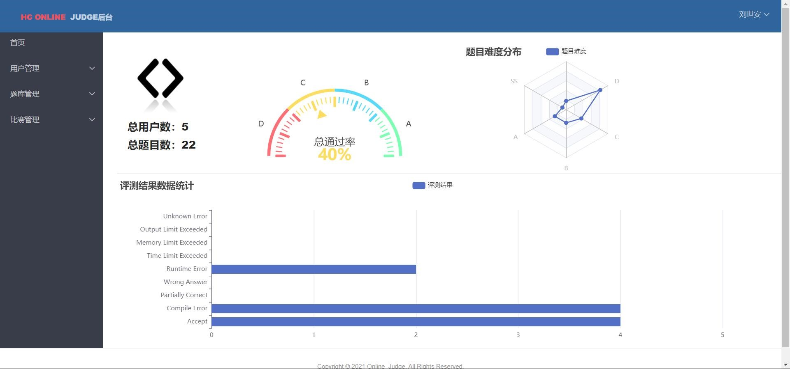
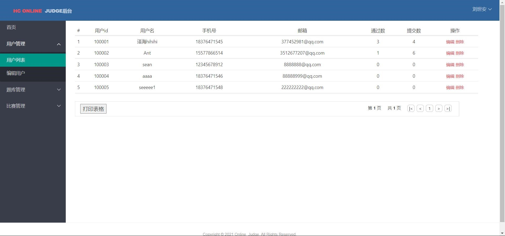
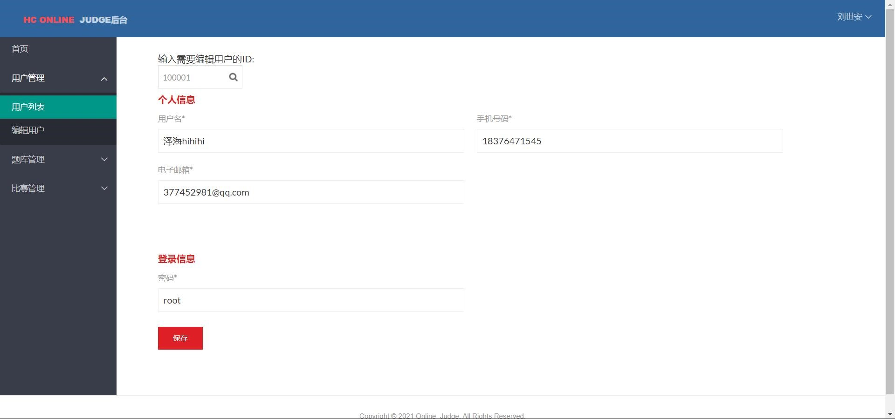
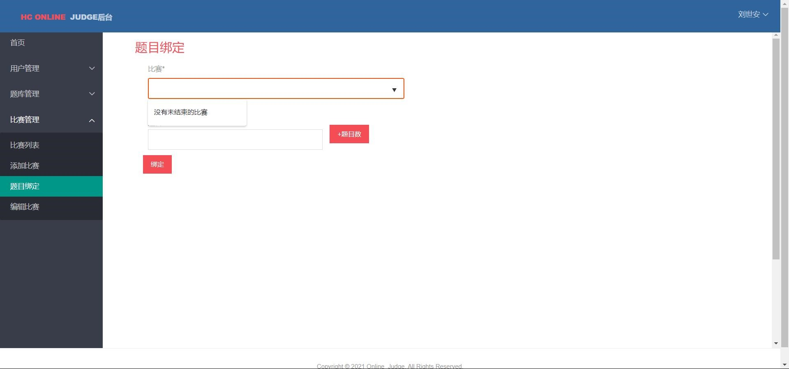

## 用户页面
### 首页
用户端首页提供五个栏目，分别是题库、比赛、提交记录、排行榜和账户

### 用户内容页
用户登录：用户在未登录的情况下可以浏览 OJ系统的所有信息，但不可以提交程序进行评测。用户应先进行注册，再使用注册的账号登录系统。

题库功能：在该功能中用户可以查看题目列表以及题目信息。在题目列表页中可了解到各题目的通过状态、题目名称、难度和通过率等基本信息。

选中一道想要练习的题目，点击该题目名称，进入查看题目的具体信息。题目具体信息的下方有一个提交代码的输入框，可以用于提交代码进行评测。

提交代码之后，用户可以查看提交记录来了解评测情况。

## 管理员页面
管理员需要输入后台页面url跳转进入后台。验证管理员身份之后才可以访问后台。

管理员登录之后将进入后台首页，在首页可以观看各种统计信息的可视化展示效果。

在页面的左侧是后台管理系统的导航条。导航条目前提供用户管理、题库管理、比赛管理三大模块的导航。三大模块都各自拥有的一个展示列表功能，列表内可以对列表项进行删除、编辑操作，还能将当前列表页的信息打印。

点击列表页中的按钮可以编辑用户信息。另外点击导航栏中的编辑用户，也可以跳转编辑用户页。在编辑用户页上方提供了一个搜索框，可根据用户ID搜索相应用户。

在题库管理模块中，与用户管理不同的是多了一个添加题目的功能，在添加题目功能中可以添加题目的各种详细信息，在添加测试点中还能根据实际需求添加多个测试点（预设不超过五个）。

比赛管理模块还拥有题目绑定的功能，可以通过题目绑定，为比赛添加未公开题目。页面中的两个文本框均为下拉搜索框，当系统中拥有未绑定题目的比赛与未绑定比赛不公开的题目是就会显示在框内，没有时则会显示提示信息。
